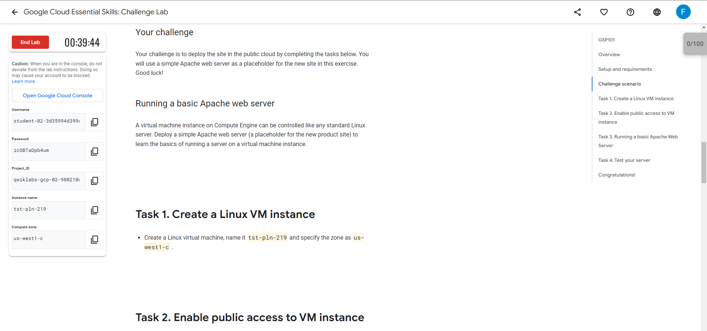
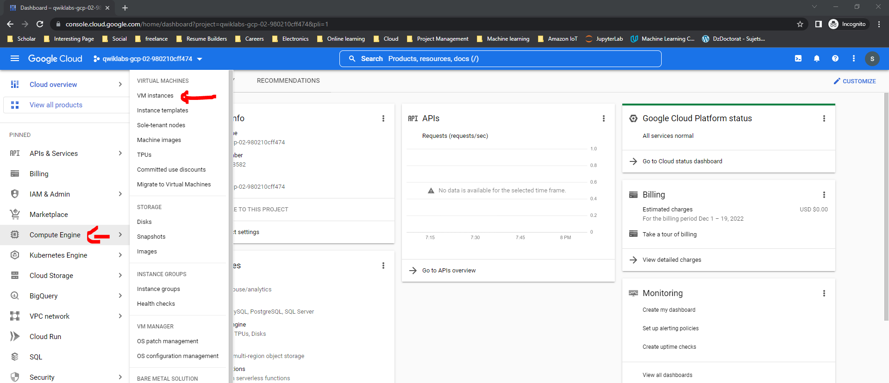
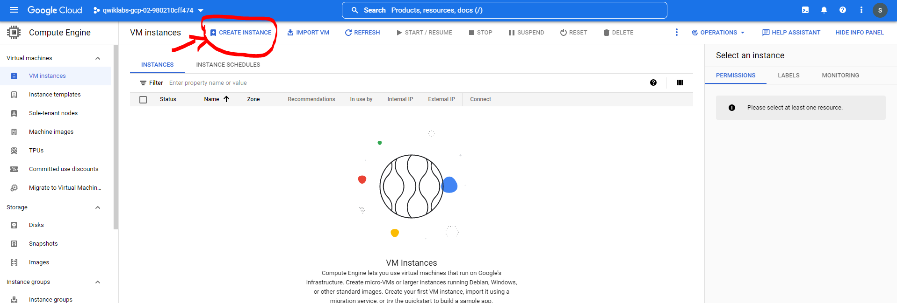
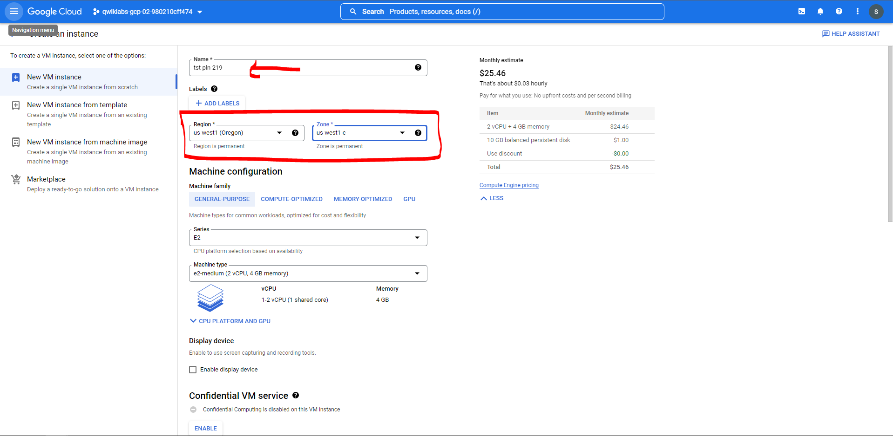
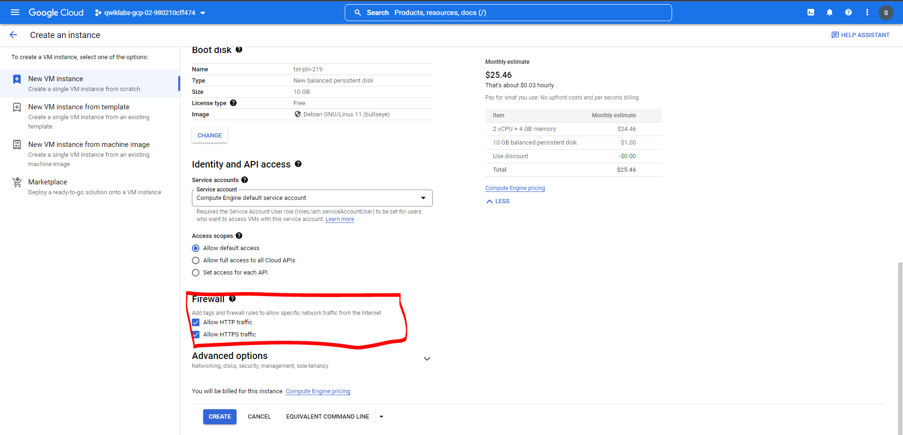
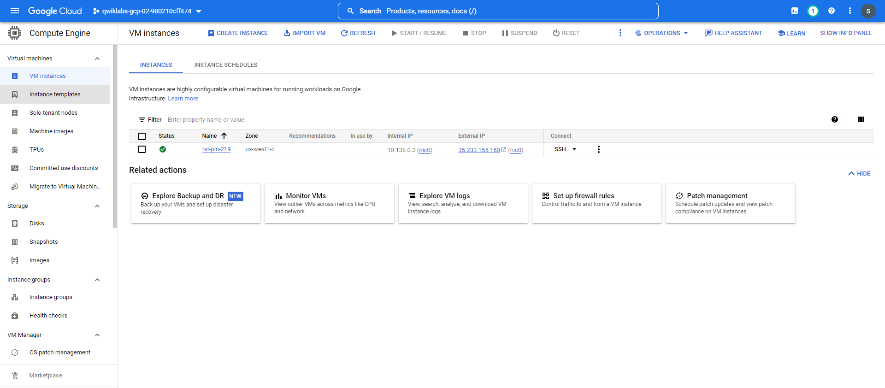
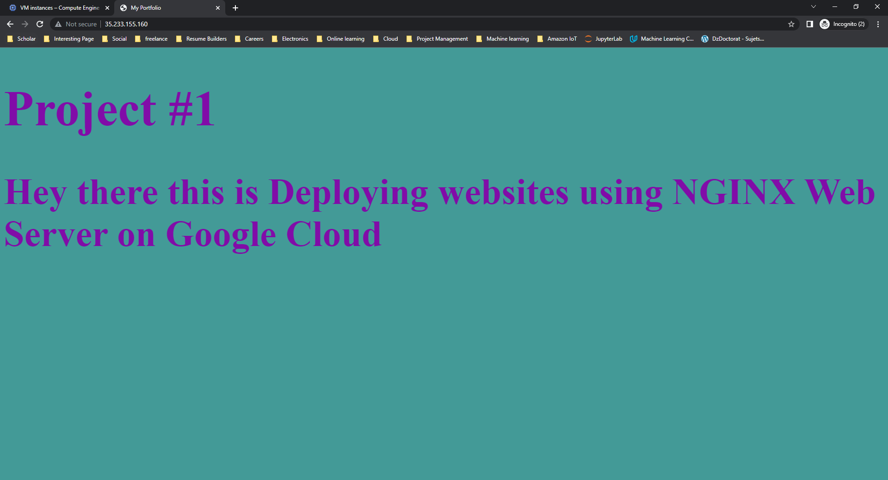

# Project deploying websites using NGINX Web Server on Google Cloud

This repo explain the [Qwiklab](https://www.cloudskillsboost.google/catalog_lab/1077) is to deploy the site in the public cloud by completing the tasks below. here we will use a simple web  server page as a placeholder for the new site.
 

## Create a Linux VM instance

-   Create a Linux virtual machine, name it  `Instance name`  and specify the zone as  `Compute zone`  as they are mentioned in the lab. 

 
 
 

## Enable public access to VM instance

- While creating the Linux instance, make sure to apply the appropriate firewall rules so that potential customers can find your new product.

 

## Running a basic Apache Web Server

-   Deploying a simple web server page (a placeholder for the new product site) to learn the basics of running a server on a virtual machine instance.
we need to run these command:

**update the package index**
`sudo apt-get update`

**Install the Apache2 package**
`sudo apt-get install apache2 -y`

**Create a new default web page by overwriting the default**
```
echo '<!DOCTYPE html>
<html>
<head>
	<meta charset="utf-8">
	<meta name="viewport" content="width=device-width, initial-scale=1">
	<title>My Portfolio</title>

	<style type="text/css">
		.body{
			background-color: #439A97;
			font-size: 40pt;
			color: #810CA8;
		}
	</style>
</head>
<body class="body">
<h1>Project #1</h1>
<h2>Hey there this is Deploying websites using NGINX Web Server on Google Cloud</h2>
</body>
</html>' | sudo tee /var/www/html/index.html`
```

 

## Test your server

-   To test that the instance is serving traffic on its external IP. we should see the web page (a placeholder for the new product site).

 